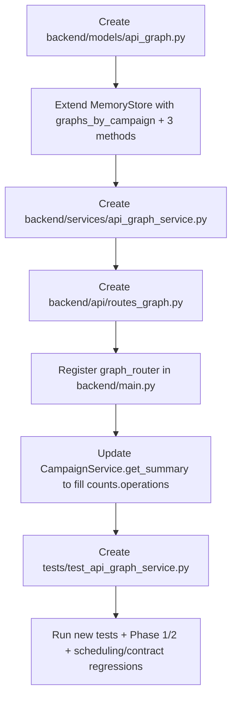

# Phase 3 — API Graph / Dependency Graph (ANALYZE ONLY plan)

This is a planning document. **No file changes** will be made until the user confirms the plan and unblocks implementation.

---

## 1. Existing graph / surface / OpenAPI / corpus structures (audit)

### 1.1 Per-execution graph (already in repo, must NOT be broken)

[backend/services/graph_state_service.py](backend/services/graph_state_service.py) — `GraphStateService` maintains a transient graph stored **inside `ExecutionContext.graph_state`** with `version: "v1"`, `nodes: {}`, `edges: []`.

- Node kinds today: `auth_context`, `object`, `object_state`, `workflow_state`.
- Edge type today: `requires` (e.g. `task:{id} -> auth:{alias}:context`).
- Node ID patterns: `auth:{alias}:context`, `object:{family}:{id}`, `object_family:{family}:ready`, `workflow:{state_id}:ready`, `task:{id}`.
- Public methods: `ensure_graph`, `upsert_auth_identities`, `upsert_prepared_object`, `upsert_harvested_ids`, `upsert_workflow_context`, `auth_context_available`, `resolve_object_id`, `workflow_state_available`, `build_required_nodes`, `add_requirement_edges`.
- Used by `TaskExecutabilityService`, `TaskScheduler._apply_evidence_runtime_enrichment`, `FollowupTaskGenerationService` and tested in [tests/test_graph_state_integration.py](tests/test_graph_state_integration.py).
- **Scope:** per `ExecutionContext`, ephemeral, NOT campaign-persistent.

### 1.2 Surface representation (read-only reuse)

- [backend/models/api_surface.py](backend/models/api_surface.py) — `NormalizedEndpoint(path, method, operation_id, path_params, query_params, body_fields, auth_required, security_schemes, tags, object_param_name, candidate_classes, candidate_scores, ...)`.
- [backend/services/openapi_normalizer.py](backend/services/openapi_normalizer.py) — already infers `object_param_name`, `candidate_classes` (`authorization`/`injection`/`business_logic`).
- [backend/services/surface_merge_service.py](backend/services/surface_merge_service.py) — merges multiple surfaces by `(method, path)`.
- [backend/services/surface_enrichment_service.py](backend/services/surface_enrichment_service.py) — best-effort tag/object inference.
- [backend/services/openapi_baseline_synthesis_service.py](backend/services/openapi_baseline_synthesis_service.py) — has `find_operation`, `_request_schema`, `_response_schema_property_names`, `_schema_property_names`, `find_family_endpoints` (creators/lists), `harvest_response`, `_collect_ids` (response id harvesting). All useful read-only helpers.
- [backend/services/resource_family_inference_service.py](backend/services/resource_family_inference_service.py) — `infer(path, method, tags, operation_id, summary, body_fields, query_params, response_fields)` returns a `resource_type` family. Already campaign-agnostic.
- [backend/services/openapi_service.py](backend/services/openapi_service.py) — `parse(request)` returns the parsed surface from spec text or URL.

### 1.3 Corpus (Phase 2) — already campaign-scoped

- [backend/models/corpus.py](backend/models/corpus.py) — `RequestCorpusItem(campaign_id, operation_id, method, path_template, auth_profile, status_code, classification, extracted_ids, sensitive_fields)` and `ResourceInstance(resource_type, object_id, owner_role, observed_by_roles)`.
- [backend/services/request_corpus_service.py](backend/services/request_corpus_service.py) — `list_by_campaign`, `find_successful_by_operation`, `find_replay_seed`, `find_cross_role_candidates`, `find_ids_by_resource_type`. Creates `ResourceInstance` from `extracted_ids` per item.

### 1.4 Storage

[backend/storage/memory_store.py](backend/storage/memory_store.py) — has `corpus_items`, `corpus_by_campaign`, `resource_instances`, `resources_by_campaign`, `campaigns`. **No graph storage exists yet.**

### 1.5 Gap

There is no persistent, campaign-scoped API graph. No `Operation` node, no `Parameter`/`AuthProfile`/`RequestExample`/`ResponseExample` nodes, no producer-consumer dependency edges. Everything graph-shaped today is per-`ExecutionContext`.

---

## 2. Existing services to reuse (read-only, do not modify)

- [backend/services/openapi_baseline_synthesis_service.py](backend/services/openapi_baseline_synthesis_service.py) → `find_operation`, `_request_schema`, `_response_schema_property_names`, `_schema_property_names`, `_parse_spec_text`, `_collect_ids`.
- [backend/services/resource_family_inference_service.py](backend/services/resource_family_inference_service.py) → `infer(...)` for `resource_type`.
- [backend/services/openapi_normalizer.py](backend/services/openapi_normalizer.py) → optional `_candidate_classes` for OWASP heuristic.
- [backend/services/openapi_service.py](backend/services/openapi_service.py) → `parse(request)` if we want to share the normalized surface (we will only call existing helpers, not modify).
- [backend/services/request_corpus_service.py](backend/services/request_corpus_service.py) → `list_by_campaign`, `find_cross_role_candidates`, `find_ids_by_resource_type`.
- [backend/storage/memory_store.py](backend/storage/memory_store.py) → extend additively, do not change existing API.
- [backend/services/campaign_service.py](backend/services/campaign_service.py) → fill `CampaignSummary.counts.operations` (currently always 0). One-line change.

---

## 3. Files to MODIFY (additive only)

- [backend/storage/memory_store.py](backend/storage/memory_store.py) — add `graphs_by_campaign: dict[str, dict[str, Any]]` and three methods (`store_graph_for_campaign`, `get_graph_for_campaign`, `replace_graph_for_campaign`).
- [backend/services/campaign_service.py](backend/services/campaign_service.py) — `get_summary()`: read `operations_count` from the new graph storage.
- [backend/main.py](backend/main.py) — register the new `graph_router` after `corpus_router`.

**Do NOT touch any other file** (see section 15).

---

## 4. Files to CREATE

- `backend/models/api_graph.py` — Pydantic models (section 5).
- `backend/services/api_graph_service.py` — `ApiGraphService` (section 11). One service file in Phase 3, internally split into `_OpenApiIngester`, `_CorpusEnricher`, `_DependencyInferer` helper classes. A separate `dependency_graph_service.py` is deferred to a later phase.
- `backend/api/routes_graph.py` — three minimal endpoints (section 10).
- `tests/test_api_graph_service.py` — tests (section 12).

---

## 5. Graph data model (`backend/models/api_graph.py`)

Use `from __future__ import annotations` and `Field(default_factory=...)` (no mutable defaults). Pydantic style consistent with [backend/models/corpus.py](backend/models/corpus.py).

```python
class Operation(BaseModel):
    operation_id: str                # "op_GET_/api/vehicle/{vehicleId}"
    operation_id_from_spec: str = ""
    method: str = "GET"
    path_template: str = ""
    summary: str = ""
    tags: list[str] = Field(default_factory=list)
    auth_required: bool = False
    security: list[str] = Field(default_factory=list)
    path_params: list[str] = Field(default_factory=list)
    query_params: list[str] = Field(default_factory=list)
    body_fields: list[str] = Field(default_factory=list)
    response_fields: list[str] = Field(default_factory=list)
    resource_type: str = ""
    risk_hints: list[str] = Field(default_factory=list)        # "object_id_in_path", "writes_state", "cross_role_signal", ...
    owasp_candidates: list[str] = Field(default_factory=list)  # "API1_BOLA", "API3_BOPLA", "API5_BFLA", "API2_AUTH"
    sources: list[str] = Field(default_factory=list)           # ["openapi"], ["openapi","corpus"], ["corpus_only"]
    observed_status_codes: list[int] = Field(default_factory=list)
    observed_roles: list[str] = Field(default_factory=list)
    successful_seed_request_ids: list[str] = Field(default_factory=list)
    auth_baseline_request_ids: list[str] = Field(default_factory=list)

class ResourceType(BaseModel):
    resource_type: str
    operations_producing: list[str] = Field(default_factory=list)
    operations_consuming: list[str] = Field(default_factory=list)
    instance_count: int = 0

class Parameter(BaseModel):
    parameter_id: str                # "param:{op_id}:{location}:{name}"
    operation_id: str
    name: str
    location: str                    # "path" | "query" | "body" | "header"
    object_id_hint: bool = False
    resource_type_hint: str = ""

class AuthProfile(BaseModel):
    auth_profile_id: str             # "auth:{role}"
    role_name: str
    has_credentials: bool = False
    operations_observed: list[str] = Field(default_factory=list)

class RequestExample(BaseModel):
    example_id: str                  # "rex_..."
    operation_id: str
    request_id: str                  # corpus request_id
    auth_profile: str = ""
    status_code: int = 0
    classification: str = ""

class ResponseExample(BaseModel):
    example_id: str                  # "respx_..."
    operation_id: str
    request_id: str
    status_code: int = 0
    response_fields_seen: list[str] = Field(default_factory=list)
    extracted_id_keys: list[str] = Field(default_factory=list)

class ResourceInstanceRef(BaseModel):
    resource_instance_id: str        # mirrors corpus res_<...>
    resource_type: str
    object_id: str
    owner_role: str = ""
    observed_by_roles: list[str] = Field(default_factory=list)
    cross_role_observed: bool = False

class GraphEdge(BaseModel):
    edge_id: str
    type: str                        # see section 6
    from_node: str
    to_node: str
    confidence: float = 1.0
    sources: list[str] = Field(default_factory=list)
    metadata: dict[str, Any] = Field(default_factory=dict)

class ApiGraph(BaseModel):
    schema_version: str = "api-graph/v1"
    campaign_id: str
    operations: list[Operation] = Field(default_factory=list)
    resource_types: list[ResourceType] = Field(default_factory=list)
    parameters: list[Parameter] = Field(default_factory=list)
    auth_profiles: list[AuthProfile] = Field(default_factory=list)
    request_examples: list[RequestExample] = Field(default_factory=list)
    response_examples: list[ResponseExample] = Field(default_factory=list)
    resource_instances: list[ResourceInstanceRef] = Field(default_factory=list)
    edges: list[GraphEdge] = Field(default_factory=list)
    built_at: str = ""
    last_corpus_ingest_at: str = ""

class GraphSummary(BaseModel):
    campaign_id: str
    operations_total: int = 0
    operations_with_seed: int = 0
    operations_auth_required: int = 0
    operations_undocumented: int = 0
    high_risk_operations: list[str] = Field(default_factory=list)
    object_id_operations: list[str] = Field(default_factory=list)
    bola_candidates: list[str] = Field(default_factory=list)
    bfla_candidates: list[str] = Field(default_factory=list)
    bopla_candidates: list[str] = Field(default_factory=list)
    cross_role_signal_operations: list[str] = Field(default_factory=list)
    resource_types: list[str] = Field(default_factory=list)
    seeded_operations_by_role: dict[str, list[str]] = Field(default_factory=dict)

class GraphBuildRequest(BaseModel):
    openapi_spec_text: str           # required; Phase 3 does NO network fetch

class GraphBuildResponse(BaseModel):
    campaign_id: str
    operations_count: int
    edges_count: int
    resource_types_count: int
    parameters_count: int
    auth_profiles_count: int
    sources_used: list[str] = Field(default_factory=list)   # ["openapi", "corpus"]
```

Node ID conventions are intentionally distinct from `graph_state_service.py` to avoid any collision:

| Node             | ID format                                  |
|------------------|--------------------------------------------|
| Operation        | `op_<METHOD>_<path_template>`              |
| ResourceType     | `restype:<resource_type>`                  |
| Parameter        | `param:<op_id>:<location>:<name>`          |
| AuthProfile      | `auth:<role>` (no `:context` suffix)       |
| RequestExample   | `rex:<short_uuid>`                         |
| ResponseExample  | `respx:<short_uuid>`                       |
| ResourceInstance | `res:<resource_type>:<object_id>`          |

---

## 6. Edge model

| `type`                 | from                | to                                | source                                  |
|------------------------|---------------------|-----------------------------------|-----------------------------------------|
| `HAS_PARAM`            | Operation           | Parameter                         | OpenAPI                                 |
| `RETURNS_FIELD`        | Operation           | response field name (string node) | OpenAPI response                        |
| `PRODUCES`             | Operation           | ResourceType                      | OpenAPI POST + id-shaped response field |
| `CONSUMES`             | Operation           | ResourceType                      | OpenAPI path/query id parameter         |
| `REQUIRES_AUTH`        | Operation           | AuthProfile / `"any"`             | OpenAPI security or observed            |
| `OWNED_BY`             | ResourceInstanceRef | AuthProfile                       | corpus (only when explicitly observed)  |
| `MAY_TRIGGER_OWASP`    | Operation           | OWASP candidate (string node)     | inferred                                |
| `HAS_EXAMPLE`          | Operation           | RequestExample / ResponseExample  | corpus                                  |
| `HAS_RESOURCE_INSTANCE`| ResourceType        | ResourceInstanceRef               | corpus                                  |

**Producer-consumer rule (Phase 3, heuristic):**

- `POST` whose response schema contains an id-shaped key (`id`, `uuid`, `<resource>Id`, ...) AND `resource_type(op)==X` → `op PRODUCES X` (confidence `0.8` from spec).
- Operation whose path/query parameter name is the id-key for a known `resource_type` X (e.g. `vehicleId` for `vehicle`) → `op CONSUMES X` (confidence `0.8` from spec).
- Corpus upgrade: when the same id value extracted from a producing-op response in `successful_seed` corpus also appears in a consuming-op request URL in `successful_seed` corpus → upgrade confidence to `0.95`, set `sources=["openapi","corpus"]`. Restricted to `successful_seed` to avoid noise.

**OWASP candidate heuristic (deterministic, no findings created):**

- `auth_required + object_id_in_path` → `API1_BOLA`.
- `body_fields` contains sensitive-named keys (`role`, `is_admin`, `permission`, `password`, `email`) → `API3_BOPLA`.
- `path_template` contains `/admin` or operation tagged `admin` and `auth_required` → `API5_BFLA`.
- `auth_required is False` for an operation matching admin/sensitive heuristics → `API2_AUTH`.

---

## 7. Building from OpenAPI

`ApiGraphService.build_from_openapi(campaign_id: str, openapi_spec_text: str) -> ApiGraph`:

1. Validate `campaign_id` exists in `memory_store.campaigns`; raise if missing.
2. Parse spec via `OpenApiBaselineSynthesisService._parse_spec_text` (read-only reuse).
3. Walk `paths.<path>.<method>`. For each operation:
   - `operation_id = f"op_{METHOD}_{path_template}"` (deterministic; we do not depend on optional `operationId`).
   - `operation_id_from_spec = operation.get("operationId") or ""`.
   - `path_params`/`query_params` from `_parameters`, `body_fields = _schema_property_names(_request_schema)`, `response_fields = _response_schema_property_names`.
   - `auth_required` from operation-level `security` (fallback to document-level).
   - `resource_type = ResourceFamilyInferenceService.infer(...)`.
   - Apply `risk_hints` and `owasp_candidates` heuristics from section 6.
4. Create `Parameter` nodes + `HAS_PARAM` edges (one per declared param).
5. Create `ResourceType` nodes (deduped). Apply `PRODUCES`/`CONSUMES` edges from section 6.
6. Create `REQUIRES_AUTH` edges (to `AuthProfile("any")` if no specific role known).
7. Create `MAY_TRIGGER_OWASP` edges.
8. Persist `ApiGraph.model_dump(mode="json")` plus `operations_count` via `memory_store.replace_graph_for_campaign(...)`.

The build is **idempotent**: re-running fully replaces OpenAPI-derived structure, then re-runs `ingest_corpus` so existing corpus enrichment is preserved.

---

## 8. Enriching from corpus

`ApiGraphService.ingest_corpus(campaign_id: str) -> ApiGraph`:

1. Read all `RequestCorpusItem` for `campaign_id` via `RequestCorpusService.list_by_campaign`.
2. For each item:
   - Match to existing `Operation` by `(method, path_template)`. If no match (corpus-only path), create a new `Operation` with `sources=["corpus_only"]` and no spec-derived fields.
   - Append `status_code` to `operation.observed_status_codes` (deduped).
   - Append `auth_profile` to `operation.observed_roles`; create/refresh `AuthProfile`.
   - `successful_seed` → push `request_id` into `successful_seed_request_ids`, create `RequestExample` and (if response body present) `ResponseExample` with `extracted_id_keys = list(item.extracted_ids.keys())`.
   - `auth_baseline` (401/403) → push `request_id` into `auth_baseline_request_ids`.
3. From `ResourceInstance`s in corpus, create `ResourceInstanceRef` nodes and `HAS_RESOURCE_INSTANCE` edges. If `len(observed_by_roles) >= 2`, set `cross_role_observed=True` on the instance and add `cross_role_signal` to the related operation's `risk_hints` (Phase 3 NEVER creates findings).
4. Run `RequestCorpusService.find_cross_role_candidates(campaign_id)`; for each candidate, mark related operation(s) with `risk_hints += ["cross_role_signal"]`.
5. Apply the producer-consumer corpus upgrade (section 6).
6. Update `last_corpus_ingest_at`.

**Phase 3 explicitly does NOT** create findings, modify Judge inputs, modify EvidenceBuilder, or feed anything into the planner.

---

## 9. Compact summary for the planner

`ApiGraphService.summary_for_planner(campaign_id: str) -> GraphSummary` returns the shape from section 5. It is **read-only**; `task_planner.py` is **not** modified in Phase 3. Future phases (or LLM router) will consume this summary; for now it is exposed only via the new endpoint.

---

## 10. Minimal endpoints (`backend/api/routes_graph.py`, prefix `/v1`)

- `POST /v1/graph/{campaign_id}/build` — body `GraphBuildRequest{ openapi_spec_text }`. Internally runs `build_from_openapi` then `ingest_corpus`. Returns `GraphBuildResponse`. **No network fetch in Phase 3** (per user's confirmed answer): if `openapi_spec_text` is missing/empty → `400 invalid_graph_build_request`. If campaign is unknown → `404 campaign_not_found`.
- `GET /v1/graph/{campaign_id}/summary` — returns `GraphSummary`. `404` if campaign missing or graph not built (returns empty `GraphSummary` is the alternative; we choose 404 for predictability).
- `GET /v1/graph/{campaign_id}/operations` — returns `list[Operation]`.

Three endpoints only; corpus ingestion is implicit inside `build` (idempotent).

---

## 11. Implementation steps



`ApiGraphService` public surface:

- `build_from_openapi(campaign_id, openapi_spec_text) -> ApiGraph`
- `ingest_corpus(campaign_id) -> ApiGraph`
- `get_graph(campaign_id) -> ApiGraph | None`
- `list_operations(campaign_id) -> list[Operation]`
- `summary_for_planner(campaign_id) -> GraphSummary`

Internal-only:

- `_make_operation_id(method, path_template)`
- `_OpenApiIngester` (spec → operations/parameters/edges)
- `_CorpusEnricher` (corpus → examples/instances/observed status & roles)
- `_DependencyInferer` (`PRODUCES`/`CONSUMES` from spec + corpus upgrade)
- `_classify_owasp_candidates(operation)` (heuristics, deterministic)

`MemoryStore` additions:

```python
self.graphs_by_campaign: dict[str, dict[str, Any]] = {}

def store_graph_for_campaign(self, campaign_id: str, data: dict) -> None: ...
def get_graph_for_campaign(self, campaign_id: str) -> dict | None: ...
def replace_graph_for_campaign(self, campaign_id: str, data: dict) -> None: ...
```

`CampaignService.get_summary()` change (only):

```python
graph_blob = memory_store.get_graph_for_campaign(campaign_id) or {}
operations_count = int(graph_blob.get("operations_count") or 0)
```

---

## 12. Tests to ADD (`tests/test_api_graph_service.py`)

Build tests (OpenAPI):

- `test_graph_build_creates_operation_per_openapi_path` — small inline OpenAPI dict (1 GET list, 1 POST create, 1 GET-by-id) → 3 operations with deterministic ids.
- `test_graph_build_infers_resource_type_from_path` — `/vehicle/{vehicleId}` → `resource_type="vehicle"`.
- `test_graph_build_marks_auth_required_from_security` — operation-level `security` block → `auth_required=True`.
- `test_graph_build_creates_has_param_edges` — one `HAS_PARAM` per declared parameter.
- `test_graph_build_infers_consumes_for_object_id_path_params` — `GET /vehicle/{vehicleId}` → `CONSUMES vehicle`.
- `test_graph_build_infers_produces_for_post_returning_id` — `POST /vehicle` returning `id` → `PRODUCES vehicle`.
- `test_graph_build_marks_owasp_bola_candidate_for_auth_required_object_id` — `risk_hints` contains `object_id_in_path`, `owasp_candidates` contains `API1_BOLA`.
- `test_graph_build_is_idempotent_on_repeat_call` — calling build twice yields the same operations_count and edges_count.

Corpus enrichment tests:

- `test_graph_ingest_corpus_appends_observed_status_codes_and_roles` — adding 200 user_a request enriches the matching operation.
- `test_graph_ingest_corpus_creates_request_and_response_examples` — `RequestExample`/`ResponseExample` linked to `request_id`.
- `test_graph_ingest_corpus_marks_cross_role_signal_when_two_roles_overlap_object_id` — `cross_role_signal` appears in op `risk_hints`.
- `test_graph_ingest_corpus_creates_runtime_only_operation_when_spec_misses_path` — corpus-only path produces an Operation with `sources=["corpus_only"]`.
- `test_graph_ingest_corpus_does_not_create_confirmed_findings` — `memory_store.findings == []` and `findings_by_session == {}` post-ingest.
- `test_graph_dependency_corpus_upgrade_raises_confidence` — same id value flows from POST response to GET path → producer-consumer edge confidence ≥ 0.95.

Summary / isolation / API:

- `test_graph_summary_for_planner_lists_high_risk_and_seeded_operations`.
- `test_graph_isolation_per_campaign` — two campaigns, two builds, no cross-campaign leakage.
- `test_campaign_summary_counts_operations_after_build` — `CampaignSummary.counts.operations == N`.
- `test_routes_graph_build_returns_201_and_summary_returns_200` — happy path through `TestClient`.
- `test_routes_graph_build_400_when_openapi_spec_text_missing`.
- `test_routes_graph_build_404_for_missing_campaign`.

---

## 13. Tests to RUN

Targeted (must all pass):

```bash
.venv/bin/python -m pytest tests/test_api_graph_service.py -v
.venv/bin/python -m pytest tests/test_request_corpus_service.py -v
.venv/bin/python -m pytest tests/test_campaign_compatibility.py -v
.venv/bin/python -m pytest tests/test_graph_state_integration.py -v
.venv/bin/python -m pytest tests/test_task_tooling_integration.py -v
.venv/bin/python -m pytest tests/test_routes_scheduling_diagnostics.py -v
.venv/bin/python -m pytest tests/test_task_contract_alignment.py -v
.venv/bin/python -m pytest tests/test_dify_workflow_dispatch_contract.py -v
```

Full sweep to confirm no new regressions beyond the pre-existing 10 collection errors / 60 failures already documented in Phase 1/2 reports:

```bash
.venv/bin/python -m pytest tests/ -v
```

---

## 14. Regression risks

- **Naming collision risk with `graph_state_service` node IDs.** Per-execution graph uses `auth:<alias>:context`; Phase 3 uses `auth:<role>` with no `:context` suffix. The two graphs live in **completely separate storage** (per-execution `ExecutionContext.graph_state` vs campaign-scoped `MemoryStore.graphs_by_campaign`). No code path mixes them.
- **`MemoryStore.__init__` change** is additive — same risk class as Phase 1/2 (already proven safe).
- **`CampaignService.get_summary()`** uses `.get(campaign_id) or {}` defaulting → safe when no graph is built yet.
- **OpenAPI helper reuse**: only **read-only** calls to `OpenApiBaselineSynthesisService` private helpers and `ResourceFamilyInferenceService`. If the user prefers no reuse of `_underscore` helpers, the alternative is to embed minimal duplicate parsing inside `ApiGraphService` (slightly more code, zero coupling).
- **Per-execution `graph_state_service.py`** stays untouched — protects the BOLA flow.
- **Pydantic / Python 3.10+ compatibility** — all new modules use `from __future__ import annotations` and `Field(default_factory=...)`.
- **No network fetch in Phase 3** — caller must pass `openapi_spec_text` (e.g. forwarded from `/v1/recon/openapi`'s upstream). `Campaign.openapi_url` stays a recorded value only.

---

## 15. Files that MUST NOT be touched in Phase 3

- `backend/app/*` (entire legacy SQLAlchemy backend).
- [backend/services/graph_state_service.py](backend/services/graph_state_service.py) — read-only reference.
- `backend/services/task_planner.py`, `backend/services/task_scheduler.py`, `backend/services/task_generator.py`, `backend/services/task_executability_service.py`, `backend/services/followup_task_generation_service.py`.
- `backend/services/evidence_builder_service.py`.
- `backend/services/tool_wrappers/*`.
- `backend/services/request_corpus_service.py` (Phase 2 — call only, do not modify).
- `backend/services/openapi_baseline_synthesis_service.py`, `backend/services/openapi_normalizer.py`, `backend/services/openapi_service.py`, `backend/services/surface_merge_service.py`, `backend/services/surface_enrichment_service.py`, `backend/services/resource_family_inference_service.py` (read-only reuse only).
- `backend/api/routes_recon.py`, `backend/api/routes_planning.py`, `backend/api/routes_scheduling.py`, `backend/api/routes_tests.py`, `backend/api/routes_tool_wrappers.py`, `backend/api/routes_store.py`, `backend/api/routes_corpus.py`, `backend/api/routes_campaigns.py`.
- `backend/models/testing.py`, `backend/models/scheduling.py`, `backend/models/planning.py`, `backend/models/tool_wrappers.py`, `backend/models/api_surface.py`, `backend/models/recon.py`, `backend/models/corpus.py`, `backend/models/campaign.py`.
- `dify/*` (Dify workflow DSL).
- All existing test files.
- No Neo4j / no real fuzzer or scanner integrations.

---

## 16. Confirmation questions before implementation

The two architectural choices (one service file, no network fetch on build) are already confirmed. Three remaining smaller calls before I implement:

1. **Producer-consumer corpus upgrade scope.** I propose restricting the runtime confidence upgrade (0.8 → 0.95) to **`successful_seed`** corpus items only, to avoid noise from 4xx/5xx. Confirm.
2. **Cross-role signal placement.** When `find_cross_role_candidates` matches, I propose adding `cross_role_signal` only to the operation's `risk_hints` (and to `cross_role_signal_operations` in the summary). I do **not** propose creating an Observation/finding (Phase 3 is graph-only). Confirm.
3. **`GET /v1/graph/{campaign_id}/summary` when no graph is built.** I propose `404 graph_not_built` for predictability. Alternative: return an empty `GraphSummary` with zero counts. Confirm preference.

After confirmation I will implement strictly per sections 1–15 and report:
- changed/created files,
- final model shapes and service method signatures,
- tests added,
- test commands and pass/fail results,
- which failures are pre-existing and unrelated,
- safety-for-review summary.