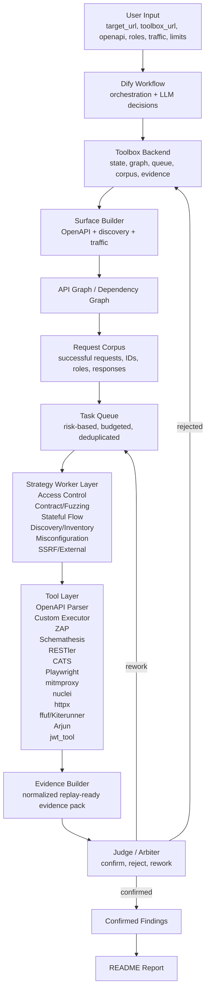

# Подробная архитектура многоагентной REST API DAST-системы с арбитром

## 1. Назначение системы

Система предназначена для автоматизированного тестирования безопасности REST API с использованием многоагентного подхода, инструментальных backend-wrapper-ов, графа состояния API, корпуса успешных запросов и отдельного арбитра, который подтверждает только воспроизводимые уязвимости.

Главная идея:

```text
Система не должна просто запускать набор сканеров.
Система должна накапливать знания о REST API и использовать их для более точного поиска уязвимостей.
```

Ключевой принцип:

```text
Каждый успешный запрос превращается в reusable seed:
успешный request → extracted IDs → ownership/context → derived tests → evidence → judge → finding/rework/reject
```

Цель архитектуры:

```text
target_url + toolbox_url + openapi/swagger/traffic/roles
        ↓
surface discovery + OpenAPI ingest
        ↓
API graph + dependency graph + request corpus
        ↓
risk-based task queue
        ↓
worker layer выбирает одну bounded tool command
        ↓
tool layer выполняет запросы/сканеры
        ↓
evidence builder собирает replay-ready evidence pack
        ↓
judge подтверждает, отклоняет или отправляет на доработку
        ↓
confirmed findings → README report
```

---

## 2. Архитектурное разделение ответственности

### 2.1 Dify

Dify должен быть **оркестратором**, а не хранилищем полного состояния.

Dify отвечает за:

```text
- получение входных параметров;
- нормализацию input;
- вызов backend endpoints;
- запуск LLM-агентов для планирования/выбора стратегии;
- выполнение bounded loop;
- вызов Judge;
- финальную генерацию отчёта.
```

Dify не должен:

```text
- хранить полный request corpus;
- хранить все raw responses;
- самостоятельно дедуплицировать findings;
- самостоятельно вести dependency graph;
- самостоятельно решать, подтверждена ли уязвимость без Judge checklist;
- передавать огромный state_json между всеми узлами.
```

### 2.2 Backend / Toolbox

Backend является ядром системы.

Backend отвечает за:

```text
- создание campaign;
- хранение состояния;
- работу с API graph;
- работу с request corpus;
- хранение auth profiles;
- хранение task queue;
- запуск инструментов;
- нормализацию результатов;
- сбор evidence pack;
- дедупликацию;
- хранение confirmed findings;
- подготовку данных для отчёта.
```

### 2.3 Tool Layer

Инструменты не принимают финальное security-решение.

Инструменты дают сигналы:

```text
- успешные requests;
- ошибки;
- response diff;
- найденные endpoints;
- alert-ы;
- replay packs;
- schemas;
- extracted IDs;
- vulnerability candidates.
```

### 2.4 Judge / Arbiter

Judge является единственным компонентом, который может перевести candidate в confirmed finding.

Judge принимает:

```text
- normalized evidence;
- baseline request;
- attack request;
- negative control;
- ownership proof;
- response diff;
- raw artifact references;
- task hypothesis;
- expected behavior;
- observed behavior;
- retry history;
- scope/budget metadata.
```

Judge возвращает:

```text
CONFIRMED
NEEDS_MORE_EVIDENCE
REJECTED
DUPLICATE
OUT_OF_SCOPE
INCONCLUSIVE
```

---

## 3. Обновлённая схема высокого уровня



---

## 4. Основной алгоритм работы от начала до конца

Ниже описан целевой pipeline. Он специально разложен на фазы, чтобы было понятно:

```text
- что делает этап;
- какие данные получает;
- какие данные отдаёт;
- кто владелец этапа: Dify, Backend, LLM Agent, Tool.
```

---

# Фаза 0. Input Normalization

## Назначение

Привести пользовательский ввод к единому формату и создать первичный execution context.

## Входные данные

Пользователь передаёт:

```json
{
  "target_url": "http://host.docker.internal:8888",
  "toolbox_url": "http://localhost:8000",
  "openapi_url": "https://example.com/openapi.json",
  "openapi_spec_text": "",
  "roles_json": [
    {
      "name": "user_a",
      "auth_type": "bearer",
      "token": "..."
    },
    {
      "name": "user_b",
      "auth_type": "bearer",
      "token": "..."
    },
    {
      "name": "admin",
      "auth_type": "bearer",
      "token": "..."
    }
  ],
  "traffic_requests_json": [],
  "allowed_hosts_json": ["host.docker.internal:8888"],
  "enable_discovery": true,
  "max_requests": 1000,
  "max_duration_sec": 1800,
  "max_retries_per_task": 2
}
```

## Что делает Dify

Dify node `Normalize Input` должен:

```text
- убрать trailing slash у URL;
- проверить target_url и toolbox_url;
- распарсить roles_json;
- распарсить allowed_hosts_json;
- если allowed_hosts пустой, извлечь host из target_url;
- создать run_id;
- задать default limits;
- собрать execution_context_json.
```

## Выходные данные

```json
{
  "execution_context": {
    "run_id": "run-abc123",
    "target_url": "http://host.docker.internal:8888",
    "toolbox_url": "http://localhost:8000",
    "openapi_url": "https://example.com/openapi.json",
    "roles": [],
    "allowed_hosts": ["host.docker.internal:8888"],
    "traffic_requests": [],
    "enable_discovery": true,
    "max_requests": 1000,
    "max_duration_sec": 1800,
    "max_retries_per_task": 2
  }
}
```

## Важная рекомендация

После normalization нужно добавить отдельный backend-вызов:

```http
POST /v1/campaigns
```

Сейчас в DSL можно работать через `run_id`, но целевая архитектура должна использовать `campaign_id`.

---

# Фаза 1. Create Campaign

## Назначение

Создать сущность campaign в backend и дальше в Dify передавать только `campaign_id`.

## Входные данные

```json
{
  "run_id": "run-abc123",
  "target_url": "http://host.docker.internal:8888",
  "openapi_url": "https://example.com/openapi.json",
  "roles": [],
  "allowed_hosts": [],
  "limits": {
    "max_requests": 1000,
    "max_duration_sec": 1800,
    "max_retries_per_task": 2
  }
}
```

## Backend создаёт

```text
campaigns
auth_profiles
campaign_limits
initial_state
empty_api_graph
empty_dependency_graph
empty_request_corpus
empty_task_queue
```

## Выходные данные

```json
{
  "campaign_id": "cmp_01HV...",
  "state_version": 1,
  "status": "created",
  "limits": {
    "max_requests": 1000,
    "remaining_requests": 1000,
    "max_duration_sec": 1800,
    "max_retries_per_task": 2
  }
}
```

## Что дальше передавать между узлами Dify

Вместо большого `state_json`:

```json
{
  "campaign_id": "cmp_01HV...",
  "run_id": "run-abc123"
}
```

---

# Фаза 2. OpenAPI / Swagger Intake

## Назначение

Если есть OpenAPI/Swagger, разобрать спецификацию и построить первичную поверхность API.

## Входные данные

```json
{
  "campaign_id": "cmp_01HV...",
  "target_url": "http://host.docker.internal:8888",
  "openapi_url": "https://example.com/openapi.json",
  "openapi_spec_text": "",
  "roles": []
}
```

## Backend endpoint

```http
POST /v1/recon/openapi
```

## Что должен делать backend

```text
- скачать OpenAPI по URL или взять openapi_spec_text;
- определить версию спецификации;
- нормализовать servers;
- нормализовать paths;
- извлечь operations;
- извлечь path/query/header/cookie parameters;
- извлечь requestBody schemas;
- извлечь response schemas;
- извлечь examples;
- извлечь enums;
- извлечь security schemes;
- извлечь operation-level security requirements;
- определить object-id candidates;
- определить sensitive fields;
- построить первичные risk hints.
```

## Пример operation

```json
{
  "operation_id": "op_get_vehicle_by_id",
  "method": "GET",
  "path_template": "/identity/api/v2/vehicle/{vehicleId}",
  "tags": ["vehicle"],
  "summary": "Get vehicle by id",
  "auth_required": true,
  "security": ["bearerAuth"],
  "path_params": [
    {
      "name": "vehicleId",
      "type": "string",
      "is_object_id_candidate": true
    }
  ],
  "query_params": [],
  "body_fields": [],
  "response_fields": ["vehicleId", "vin", "ownerId", "model"],
  "risk_hints": [
    "object_id_in_path",
    "user_owned_resource",
    "read_operation"
  ],
  "owasp_candidates": [
    "API1_BOLA",
    "API3_BOPLA"
  ],
  "source": "openapi",
  "source_confidence": 0.95
}
```

## Выходные данные

```json
{
  "campaign_id": "cmp_01HV...",
  "surface_id": "surf_openapi_1",
  "source": "openapi",
  "operations_count": 52,
  "operations": [],
  "security_schemes": [],
  "schemas": [],
  "warnings": [
    "No 403 response documented for 17 protected operations"
  ]
}
```

## Что сохранить в БД

```text
api_operations
api_parameters
api_schemas
api_security_schemes
surface_sources
```

---

# Фаза 3. Passive Discovery

## Назначение

Собрать дополнительную поверхность без агрессивного тестирования.

## Источники

```text
- ZAP passive spider;
- httpx probe;
- known swagger/openapi paths;
- robots.txt;
- sitemap.xml;
- response headers;
- links;
- JS files;
- known API prefixes.
```

## Входные данные

```json
{
  "campaign_id": "cmp_01HV...",
  "target_url": "http://host.docker.internal:8888",
  "allowed_hosts": ["host.docker.internal:8888"],
  "enable_discovery": true,
  "discovery_mode": "safe",
  "budget": {
    "max_duration_sec": 60,
    "max_requests": 100
  }
}
```

## Backend endpoint

```http
POST /v1/recon/passive-discovery
```

## Выходные данные

```json
{
  "campaign_id": "cmp_01HV...",
  "source": "passive_discovery",
  "urls": [
    {
      "url": "http://host.docker.internal:8888/api/v2/vehicle/vehicles",
      "method_hint": "GET",
      "status": 200,
      "content_type": "application/json",
      "source": "zap_passive"
    }
  ],
  "headers": {},
  "tech_hints": [],
  "swagger_candidates": []
}
```

## Что сохранить

```text
discovered_urls
surface_sources
request_corpus для successful probes
```

---

# Фаза 4. Endpoint Discovery

## Назначение

Если спецификация отсутствует или неполная, найти дополнительные REST endpoints.

## Используемые инструменты

```text
- ffuf;
- Kiterunner;
- httpx;
- ZAP spider;
- optional Playwright;
- optional mitmproxy traffic.
```

## Входные данные

```json
{
  "campaign_id": "cmp_01HV...",
  "target_url": "http://host.docker.internal:8888",
  "seeds": [
    "/api",
    "/api/v1",
    "/api/v2",
    "/identity/api",
    "/workshop/api"
  ],
  "allowed_hosts": ["host.docker.internal:8888"],
  "budget": {
    "max_requests": 300,
    "max_duration_sec": 120
  }
}
```

## Backend endpoint

```http
POST /v1/recon/discover-endpoints
```

## Выходные данные

```json
{
  "campaign_id": "cmp_01HV...",
  "source": "endpoint_discovery",
  "discovered_endpoints": [
    {
      "method": "GET",
      "path": "/workshop/api/management/users/all",
      "status": 401,
      "source": "ffuf",
      "confidence": 0.75,
      "risk_hints": ["management_path", "collection_read"]
    }
  ],
  "undocumented_candidates": []
}
```

## Что сохранить

```text
api_operations с source=discovery
inventory_diffs
discovered_urls
```

---

# Фаза 5. Traffic Import

## Назначение

Импортировать реальные HTTP-запросы из UI, HAR, mitmproxy, Playwright или пользовательского traffic JSON.

## Почему это важно

Traffic даёт системе рабочие requests, которые часто ценнее OpenAPI:

```text
- настоящие headers;
- настоящие cookies;
- реальные request bodies;
- реальные object IDs;
- последовательности действий;
- скрытые endpoints;
- параметры, которых нет в spec.
```

## Входные данные

```json
{
  "campaign_id": "cmp_01HV...",
  "traffic_requests": [
    {
      "method": "POST",
      "url": "http://host.docker.internal:8888/identity/api/auth/login",
      "headers": {},
      "body": {}
    }
  ]
}
```

## Backend endpoint

```http
POST /v1/recon/import-traffic
```

## Выходные данные

```json
{
  "campaign_id": "cmp_01HV...",
  "imported_requests_count": 24,
  "new_operations_count": 7,
  "new_sequences_count": 3,
  "new_auth_contexts_count": 2
}
```

## Что сохранить

```text
request_corpus
response_corpus
api_operations
sequence_edges
auth_profiles
resource_instances
```

---

# Фаза 6. JS / Browser Surface Analysis

## Назначение

Найти API endpoints, которые используются фронтендом, но отсутствуют в OpenAPI.

## Используемые источники

```text
- JS bundles;
- Playwright network events;
- XHR/fetch traffic;
- static regex extraction;
- source maps если доступны.
```

## Входные данные

```json
{
  "campaign_id": "cmp_01HV...",
  "target_url": "http://host.docker.internal:8888",
  "js_urls": [],
  "browser_capture_enabled": true
}
```

## Backend endpoint

```http
POST /v1/recon/js-analyze
```

## Выходные данные

```json
{
  "campaign_id": "cmp_01HV...",
  "js_surface": {
    "endpoints": [
      {
        "method": "GET",
        "path": "/api/config",
        "source": "js_bundle",
        "confidence": 0.66
      }
    ],
    "api_prefixes": ["/api", "/identity/api", "/workshop/api"],
    "interesting_literals": ["admin", "debug", "token", "role"]
  }
}
```

---

# Фаза 7. Merge Surfaces

## Назначение

Объединить OpenAPI, passive discovery, endpoint discovery, traffic import и JS analysis в одну нормализованную поверхность.

## Входные данные

```json
{
  "campaign_id": "cmp_01HV...",
  "surface_sources": [
    "openapi",
    "passive_discovery",
    "endpoint_discovery",
    "traffic",
    "js"
  ]
}
```

## Backend endpoint

```http
POST /v1/surface/merge
```

## Что делает backend

```text
- нормализует path templates;
- объединяет одинаковые endpoints;
- строит source_confidence;
- помечает undocumented operations;
- помечает spec-only operations;
- помечает traffic-confirmed operations;
- объединяет schemas и observed shapes;
- обновляет risk hints;
- создаёт inventory diff.
```

## Пример output

```json
{
  "campaign_id": "cmp_01HV...",
  "operations_total": 69,
  "source_breakdown": {
    "openapi": 52,
    "traffic": 24,
    "discovery": 11,
    "js": 8
  },
  "undocumented_operations": [
    "GET /workshop/api/management/users/all"
  ],
  "high_risk_operations": [
    "GET /identity/api/v2/vehicle/{vehicleId}",
    "GET /workshop/api/management/users/all"
  ]
}
```

---

# Фаза 8. Enrich Surface

## Назначение

Добавить семантические признаки, необходимые для планирования атак.

## Что вычисляется

```text
- resource type;
- operation action: create/read/update/delete/search/login/logout/import/export;
- ownership hints;
- role hints;
- sensitive fields;
- object-id candidates;
- URL-like parameters;
- mass-assignment candidates;
- admin/management hints;
- business-flow hints;
- destructive operation hints;
- auth requirements;
- OWASP category candidates.
```

## Пример enriched operation

```json
{
  "operation_id": "op_patch_user",
  "method": "PATCH",
  "path_template": "/api/users/{userId}",
  "resource_type": "User",
  "action": "update",
  "auth_required": true,
  "object_id_params": ["userId"],
  "sensitive_fields": ["email", "role", "isAdmin", "permissions"],
  "forbidden_field_candidates": ["role", "isAdmin", "permissions"],
  "risk_score": 0.91,
  "owasp_candidates": [
    "API1_BOLA",
    "API3_BOPLA",
    "API5_BFLA"
  ]
}
```

---

# Фаза 9. Build API Graph and Dependency Graph

## Назначение

Построить graph/state, который будет использоваться для планирования.

## API Graph содержит

```text
Operation
ResourceType
Parameter
Schema
AuthProfile
RequestExample
ResponseExample
ResourceInstance
FindingCandidate
ConfirmedFinding
```

## Dependency Graph содержит

```text
Operation PRODUCES ResourceInstance
Operation CONSUMES ResourceInstance
RequestExample CREATED ResourceInstance
ResourceInstance OWNED_BY AuthProfile
Operation REQUIRES_AUTH AuthProfile
Operation MAY_TRIGGER OWASP_CATEGORY
Task TARGETS Operation
Evidence SUPPORTS CandidateFinding
```

## Пример dependency edge

```json
{
  "edge_type": "PRODUCES_CONSUMES",
  "from_operation": "POST /api/vehicles",
  "to_operation": "GET /api/vehicles/{vehicleId}",
  "producer_jsonpath": "$.id",
  "consumer_param": "vehicleId",
  "confidence": 0.89,
  "sources": ["openapi_schema", "runtime_response"]
}
```

## Backend endpoint

```http
POST /v1/graph/build
```

## Выходные данные

```json
{
  "campaign_id": "cmp_01HV...",
  "api_graph_version": 1,
  "operations_count": 69,
  "resource_types_count": 12,
  "dependency_edges_count": 41,
  "object_id_candidates_count": 27
}
```

---

# Фаза 10. Smoke Requests and Corpus Bootstrap

## Назначение

Получить минимальный набор рабочих requests, которые станут seeds для дальнейших security tests.

## Почему это критично

Без успешных запросов система не знает:

```text
- какие headers реально нужны;
- какие body fields обязательны;
- какие IDs существуют;
- какие роли имеют доступ;
- какие endpoints реально работают;
- какие schemas возвращаются в runtime.
```

## Входные данные

```json
{
  "campaign_id": "cmp_01HV...",
  "operations": ["op_get_vehicles", "op_get_profile", "op_create_vehicle"],
  "auth_profiles": ["anonymous", "user_a", "user_b", "admin"],
  "budget": {
    "max_requests": 200
  }
}
```

## Backend endpoint

```http
POST /v1/corpus/bootstrap
```

## Что делает backend

```text
- выбирает безопасные GET/HEAD endpoints;
- пробует anonymous/user_a/user_b/admin;
- использует examples/default values;
- использует traffic requests если есть;
- сохраняет все useful responses;
- извлекает IDs;
- создаёт resource_instances;
- строит role access matrix.
```

## Пример corpus item

```json
{
  "request_id": "req_001",
  "campaign_id": "cmp_01HV...",
  "operation_id": "op_get_vehicle_by_id",
  "method": "GET",
  "path_template": "/identity/api/v2/vehicle/{vehicleId}",
  "url": "http://host.docker.internal:8888/identity/api/v2/vehicle/123",
  "auth_profile": "user_a",
  "status_code": 200,
  "request_headers_shape": ["Authorization", "Accept"],
  "response_schema_hash": "sha256:...",
  "extracted_ids": {
    "vehicleId": ["123"],
    "ownerId": ["user_a"]
  },
  "sensitive_fields": ["vin", "ownerId"],
  "source": "smoke",
  "replayable": true
}
```

---

# Фаза 11. Security Context Synthesis

## Назначение

LLM получает compact summary поверхности и помогает классифицировать риски.

Важно: LLM не должен видеть все raw responses. Ему нужен compact context.

## Входные данные для LLM

```json
{
  "campaign_id": "cmp_01HV...",
  "surface_summary": {
    "operations_total": 69,
    "high_risk_operations": [],
    "undocumented_operations": [],
    "auth_schemes": [],
    "resource_types": []
  },
  "corpus_summary": {
    "successful_requests": 103,
    "auth_profiles": ["anonymous", "user_a", "user_b", "admin"],
    "resource_instances": 34
  }
}
```

## Что должен вернуть LLM

```json
{
  "security_context": {
    "priority_areas": [
      "object-level authorization",
      "admin endpoint access",
      "mass assignment",
      "undocumented endpoints"
    ],
    "resource_ownership_model": {
      "Vehicle": {
        "owner_field_candidates": ["ownerId", "userId"],
        "object_id_fields": ["vehicleId", "id"]
      }
    },
    "role_model_hypotheses": [
      {
        "role": "admin",
        "expected_access": ["/management/*"]
      }
    ]
  }
}
```

## Что сохранить

```text
security_context
risk_model
planner_hints
```

---

# Фаза 12. Initial Task Planning

## Назначение

Создать task queue с приоритетами и бюджетами.

## Backend endpoint

```http
POST /v1/tasks/plan
```

## Принцип генерации задач

Задачи создаются не “по всем endpoint × все инструменты”, а по risk-based strategy.

Примеры:

```text
Если endpoint содержит object_id и есть user_a/user_b:
  создать access_control role_swap task.

Если endpoint admin/management и доступен low-privileged:
  создать BFLA task.

Если PATCH/PUT содержит role/isAdmin/ownerId:
  создать mass_assignment task.

Если параметр содержит url/callback/webhook:
  создать SSRF task.

Если endpoint отсутствует в OpenAPI, но найден discovery:
  создать API9 inventory task.

Если schema содержит constraints:
  создать contract fuzzing task.
```

## Task object

```json
{
  "task_id": "task_001",
  "campaign_id": "cmp_01HV...",
  "class": "access_control",
  "subtype": "role_swap_object_access",
  "owasp_category": "API1_BOLA",
  "target_operation_id": "op_get_vehicle_by_id",
  "seed_request_id": "req_001",
  "hypothesis": "User B can access object owned by User A via direct object ID.",
  "required_evidence": [
    "baseline_user_a_can_access_object",
    "ownership_proof_object_belongs_to_user_a",
    "negative_control_object_not_owned_by_user_b",
    "attack_user_b_can_access_same_object",
    "same_sensitive_object_in_response"
  ],
  "allowed_tools": ["custom_request_executor"],
  "preferred_tool": "custom_request_executor",
  "fallback_tools": [],
  "priority": 95,
  "budget": {
    "max_requests": 6,
    "max_duration_sec": 30
  },
  "status": "queued",
  "retry_count": 0
}
```

---

# Фаза 13. Main Loop Overview

Главный loop должен выполнять **одну bounded command за итерацию**.

```text
loop:
  1. fetch compact state summary
  2. schedule next task
  3. dispatch task to worker class
  4. worker selects exactly one tool command
  5. parse/validate command
  6. execute tool command
  7. store tool result
  8. update corpus with useful requests
  9. build evidence pack
  10. judge evidence
  11. update queue/findings/state
  12. decide continue/stop
```

---

# Фаза 14. Loop State Manager

## Назначение

Перед каждой итерацией получить компактное состояние кампании.

## Backend endpoint

```http
GET /v1/campaigns/{campaign_id}/state-summary
```

## Выходные данные

```json
{
  "campaign_id": "cmp_01HV...",
  "state_version": 17,
  "budget": {
    "remaining_requests": 721,
    "remaining_duration_sec": 1340
  },
  "queue": {
    "queued": 42,
    "running": 0,
    "confirmed": 3,
    "rejected": 11,
    "needs_rework": 2
  },
  "coverage": {
    "operations_total": 69,
    "operations_touched": 37,
    "high_risk_operations_touched": 19
  },
  "corpus": {
    "successful_requests": 128,
    "resource_instances": 48,
    "auth_profiles": 4
  },
  "stop_reasons": []
}
```

Dify должен передавать этот summary scheduler-у и router-у, но не весь raw state.

---

# Фаза 15. Schedule Next Task

## Назначение

Выбрать следующую задачу.

## Backend endpoint

```http
POST /v1/tasks/next
```

## Входные данные

```json
{
  "campaign_id": "cmp_01HV...",
  "state_version": 17,
  "worker_capacity": 1
}
```

## Критерии выбора

```text
- priority;
- readiness;
- novelty;
- budget;
- retry_count;
- dependency availability;
- not duplicate;
- not blocked;
- expected evidence value;
- coverage gaps.
```

## Выходные данные

```json
{
  "has_task": true,
  "active_task": {
    "task_id": "task_001",
    "class": "access_control",
    "subtype": "role_swap_object_access",
    "owasp_category": "API1_BOLA",
    "seed_request_id": "req_001",
    "target_operation_id": "op_get_vehicle_by_id",
    "allowed_tools": ["custom_request_executor"],
    "required_evidence": []
  },
  "current_execution_context": {
    "campaign_id": "cmp_01HV...",
    "target_url": "http://host.docker.internal:8888",
    "auth_profiles_available": ["anonymous", "user_a", "user_b", "admin"],
    "budget_for_task": {
      "max_requests": 6
    }
  }
}
```

Если задач нет:

```json
{
  "has_task": false,
  "stop_reason": "no_runnable_tasks"
}
```

---

# Фаза 16. Task Dispatching

## Назначение

Направить task в правильный worker class.

## Worker classes

```text
access_control
contract_fuzzing
stateful_flow
discovery_inventory
misconfiguration
ssrf_external
```

## Рекомендуемая логика

Вместо параллельного запуска всех worker-узлов:

```text
task_dispatcher → worker_selector → selected_worker_prompt → parse_worker_command
```

Или в Dify через IF/ELSE:

```text
if task.class == access_control:
  Access Control Worker
elif task.class == contract_fuzzing:
  Contract/Fuzzing Worker
elif task.class == stateful_flow:
  Stateful Flow Worker
...
```

Важно: за одну итерацию должен сработать один worker.

---

# Фаза 17. Worker Command Selection

## Назначение

Worker не подтверждает уязвимость. Он только выбирает одну bounded executor command.

## Входные данные для worker

```json
{
  "active_task": {
    "task_id": "task_001",
    "class": "access_control",
    "subtype": "role_swap_object_access",
    "owasp_category": "API1_BOLA",
    "seed_request_id": "req_001",
    "required_evidence": []
  },
  "execution_context": {
    "campaign_id": "cmp_01HV...",
    "target_url": "http://host.docker.internal:8888",
    "auth_profiles_available": ["user_a", "user_b"]
  },
  "tool_preferences": {
    "preferred_tool": "custom_request_executor",
    "fallback_tools": []
  }
}
```

## Выходные данные worker-а

```json
{
  "worker": "access_control",
  "template": "role_swap_object_access",
  "toolchain": ["custom_request_executor"],
  "hypothesis": "User B may access User A vehicle by reusing vehicleId.",
  "arguments": {
    "seed_request_id": "req_001",
    "baseline_auth_profile": "user_a",
    "attack_auth_profile": "user_b",
    "checks": [
      "baseline_replay",
      "ownership_proof",
      "attack_replay",
      "negative_control"
    ]
  },
  "success_criteria": [
    "baseline returns 2xx",
    "object belongs to user_a",
    "user_b receives same object",
    "response contains sensitive object fields"
  ],
  "needs_preparation": false
}
```

## Важное правило

Worker обязан вернуть strict JSON. Нельзя возвращать prose вместо команды.

---

# Фаза 18. Parse and Validate Worker Command

## Назначение

Проверить, что worker не вышел за рамки.

## Проверки

```text
- tool входит в allowed_tools;
- arguments валидны;
- seed_request_id существует;
- auth_profile существует;
- endpoint входит в scope;
- budget не превышен;
- command не duplicate;
- команда не destructive вне разрешённого профиля;
- needs_preparation обработан отдельно.
```

## Если команда невалидна

```json
{
  "valid": false,
  "error": "Tool not allowed for this task",
  "fallback_action": "reject_worker_command_and_retry_or_replan"
}
```

---

# Фаза 19. Execute Tool Command

## Назначение

Выполнить команду через backend wrapper.

## Backend endpoint

```http
POST /v1/tools/execute
```

## Универсальный вход

```json
{
  "campaign_id": "cmp_01HV...",
  "task_id": "task_001",
  "command": {
    "tool": "custom_request_executor",
    "template": "role_swap_object_access",
    "arguments": {
      "seed_request_id": "req_001",
      "baseline_auth_profile": "user_a",
      "attack_auth_profile": "user_b"
    }
  },
  "budget": {
    "max_requests": 6,
    "max_duration_sec": 30
  }
}
```

## Универсальный выход

```json
{
  "tool_run_id": "toolrun_001",
  "campaign_id": "cmp_01HV...",
  "task_id": "task_001",
  "tool": "custom_request_executor",
  "status": "finished",
  "requests_made": 4,
  "duration_ms": 1230,
  "observations": [
    {
      "type": "role_swap_success",
      "severity_hint": "high",
      "confidence_hint": 0.82
    }
  ],
  "requests": [
    {
      "request_id": "req_201",
      "role": "user_a",
      "method": "GET",
      "url": "/identity/api/v2/vehicle/123",
      "status_code": 200
    },
    {
      "request_id": "req_202",
      "role": "user_b",
      "method": "GET",
      "url": "/identity/api/v2/vehicle/123",
      "status_code": 200
    }
  ],
  "artifacts": [
    {
      "type": "http_exchange",
      "path": "logs/dast_runs/run-abc123/toolrun_001.json"
    }
  ],
  "raw_status": "ok"
}
```

## Что сохранить

```text
tool_runs
request_corpus
response_corpus
observations
artifacts
budget_counters
```

---

# Фаза 20. Corpus Update After Execution

## Назначение

Каждый tool result должен обогащать corpus.

## Что добавлять в corpus

```text
- все 2xx/3xx requests;
- полезные 401/403 responses;
- 404 для discovered endpoint;
- 422/400 как schema constraint signal;
- 5xx как robustness/security candidate;
- extracted IDs;
- response schema hash;
- sensitive fields;
- auth profile;
- replay metadata;
- sequence position.
```

## Пример update

```json
{
  "request_id": "req_202",
  "derived_from": "req_001",
  "mutation_type": "auth_profile_swap",
  "auth_profile": "user_b",
  "status_code": 200,
  "same_object_as": "req_001",
  "security_signal": "possible_bola"
}
```

---

# Фаза 21. Build Evidence Pack

## Назначение

Собрать нормализованный evidence pack для Judge.

## Backend endpoint

```http
POST /v1/evidence/build
```

## Входные данные

```json
{
  "campaign_id": "cmp_01HV...",
  "task_id": "task_001",
  "tool_run_id": "toolrun_001",
  "worker_hypothesis": "User B may access User A vehicle.",
  "success_criteria": []
}
```

## Evidence pack

```json
{
  "evidence_id": "ev_001",
  "campaign_id": "cmp_01HV...",
  "task_id": "task_001",
  "owasp_category": "API1_BOLA",
  "hypothesis": "User B can access object owned by User A.",
  "target": {
    "operation_id": "op_get_vehicle_by_id",
    "method": "GET",
    "path_template": "/identity/api/v2/vehicle/{vehicleId}"
  },
  "baseline": {
    "request_id": "req_201",
    "auth_profile": "user_a",
    "status_code": 200,
    "object_id": "123",
    "response_hash": "sha256:a"
  },
  "attack": {
    "request_id": "req_202",
    "auth_profile": "user_b",
    "status_code": 200,
    "object_id": "123",
    "response_hash": "sha256:b"
  },
  "ownership_proof": {
    "status": "present",
    "source": "GET /vehicles as user_a",
    "object_id": "123",
    "owner_auth_profile": "user_a"
  },
  "negative_control": {
    "status": "present",
    "source": "GET /vehicles as user_b",
    "object_absent_from_user_b_collection": true
  },
  "diff_summary": {
    "same_object": true,
    "same_sensitive_fields": ["vehicleId", "vin", "ownerId"],
    "response_similarity": 0.92
  },
  "missing_evidence": [],
  "artifacts": [
    {
      "type": "http_exchange",
      "path": "logs/dast_runs/run-abc123/toolrun_001.json"
    }
  ],
  "replay": {
    "replayable": true,
    "steps": [
      "Replay baseline request as user_a",
      "Replay attack request as user_b"
    ]
  }
}
```

---

# Фаза 22. Judge Verification

## Назначение

Judge проверяет evidence checklist и принимает решение.

## Входные данные

```json
{
  "evidence": {},
  "task": {},
  "security_context": {},
  "campaign_policy": {},
  "previous_judge_decisions": []
}
```

## Judge output

```json
{
  "decision": "CONFIRMED",
  "confidence": "high",
  "severity": "high",
  "owasp_category": "API1_BOLA",
  "title": "Broken Object Level Authorization on GET /identity/api/v2/vehicle/{vehicleId}",
  "reason": "The evidence proves that user_b can access vehicle 123 owned by user_a.",
  "confirmed_evidence": [
    "baseline_user_a_can_access_object",
    "ownership_proof_object_belongs_to_user_a",
    "negative_control_user_b_does_not_own_object",
    "attack_user_b_can_access_same_object",
    "same_sensitive_object_fields_returned"
  ],
  "missing_evidence": [],
  "reproduction_steps": [
    "Authenticate as user_a and obtain vehicleId 123.",
    "Authenticate as user_b.",
    "Request GET /identity/api/v2/vehicle/123 with user_b token.",
    "Observe 200 OK with the same vehicle data."
  ],
  "remediation": [
    "Enforce object-level authorization on every object access.",
    "Check resource ownership server-side using authenticated principal.",
    "Add regression tests for cross-user object access."
  ],
  "follow_up_tasks": []
}
```

## Если доказательств мало

```json
{
  "decision": "NEEDS_MORE_EVIDENCE",
  "reason": "Attack returned 200, but ownership was not proven.",
  "missing_evidence": [
    "ownership_proof_object_belongs_to_user_a",
    "negative_control_user_b_collection_does_not_contain_object"
  ],
  "follow_up_tasks": [
    {
      "class": "access_control",
      "subtype": "prove_ownership",
      "parent_task_id": "task_001",
      "required_evidence": [
        "GET collection as user_a",
        "GET collection as user_b"
      ],
      "budget": {
        "max_requests": 4
      }
    }
  ]
}
```

---

# Фаза 23. Parse Judge Verdict

## Назначение

Привести Judge output к строгому формату для backend.

## Проверки

```text
- decision валиден;
- confidence валиден;
- severity валиден;
- follow_up_tasks валидны;
- confirmed finding содержит минимум required fields;
- reproduction steps не пустые для CONFIRMED;
- remediation не пустая для CONFIRMED.
```

---

# Фаза 24. Update Queue / State

## Назначение

Применить verdict к backend state.

## Backend endpoint

```http
POST /v1/judge/apply
```

## Если CONFIRMED

Backend должен:

```text
- создать confirmed_finding;
- связать evidence_id;
- связать request IDs;
- дедуплицировать похожие findings;
- закрыть task;
- снизить приоритет дублей;
- обновить coverage.
```

## Если NEEDS_MORE_EVIDENCE

Backend должен:

```text
- пометить task as needs_rework;
- создать follow-up tasks;
- увеличить retry_count;
- сохранить judge reason;
- ограничить rework budget.
```

## Если REJECTED

Backend должен:

```text
- пометить task rejected;
- сохранить reason;
- добавить negative learning signal;
- не повторять тот же fingerprint.
```

## Если DUPLICATE

Backend должен:

```text
- связать с existing finding;
- не создавать новый report item;
- сохранить как duplicate evidence.
```

---

# Фаза 25. Stop Conditions

Loop должен завершаться не только по количеству итераций.

## Stop reasons

```text
- no_runnable_tasks;
- max_requests_reached;
- max_duration_reached;
- all_high_risk_operations_covered;
- no_novelty_for_N_iterations;
- queue_only_contains_blocked_tasks;
- too_many_tool_errors;
- user_profile_safe_budget_exhausted;
```

## Пример final state

```json
{
  "campaign_id": "cmp_01HV...",
  "status": "finished",
  "stop_reason": "no_runnable_tasks",
  "confirmed_findings": 5,
  "rejected_candidates": 18,
  "requests_made": 742,
  "operations_touched": 51,
  "high_risk_operations_touched": 24
}
```

---

# Фаза 26. Report Context Aggregation

## Назначение

Собрать только подтверждённые findings и необходимые proof artifacts.

## Backend endpoint

```http
GET /v1/report/{campaign_id}/context
```

## Output

```json
{
  "campaign": {
    "target_url": "http://host.docker.internal:8888",
    "started_at": "...",
    "finished_at": "...",
    "profile": "balanced"
  },
  "summary": {
    "confirmed_findings": 5,
    "tested_operations": 51,
    "total_operations": 69,
    "tools_used": ["custom_request_executor", "zap", "schemathesis"]
  },
  "confirmed_findings": [
    {
      "finding_id": "finding_001",
      "owasp_category": "API1_BOLA",
      "title": "...",
      "severity": "high",
      "confidence": "high",
      "affected_endpoint": "GET /identity/api/v2/vehicle/{vehicleId}",
      "description": "...",
      "evidence": {},
      "reproduction_steps": [],
      "remediation": []
    }
  ],
  "coverage": {},
  "limitations": []
}
```

---

# Фаза 27. README Report Generation

## Назначение

Report Agent формирует итоговый README по confirmed findings.

## Правила

```text
- report использует только confirmed findings;
- rejected candidates не оформляются как vulnerabilities;
- для каждой vulnerability должны быть reproduction steps;
- каждый finding должен иметь evidence summary;
- remediation должна быть конкретной;
- если evidence неполное — finding не включается;
- можно добавить раздел Limitations.
```

## Структура отчёта

```markdown
# REST API Security Testing Report

## 1. Scope

## 2. Methodology

## 3. Tools Used

## 4. Coverage Summary

## 5. Confirmed Findings

### Finding 1: Broken Object Level Authorization

- OWASP API Top 10: API1:2023
- Severity: High
- Confidence: High
- Endpoint: GET /...

#### Description

#### Evidence

#### Reproduction Steps

#### Impact

#### Remediation

## 6. Rejected / Inconclusive Signals

## 7. Limitations

## 8. Appendix: Tested Surface
```

---

# 5. Worker Layer подробно

## 5.1 Access Control Worker

Покрывает:

```text
API1 BOLA
API2 Broken Authentication
API3 BOPLA
API5 BFLA
```

Стратегии:

```text
role_swap_object_access
anonymous_access_check
expired_token_check
malformed_token_check
low_privilege_admin_endpoint_access
mass_assignment
forbidden_field_update
excessive_data_exposure
role_matrix_probe
jwt_claim_tampering
```

Типичные входные данные:

```json
{
  "seed_request_id": "req_001",
  "baseline_auth_profile": "user_a",
  "attack_auth_profile": "user_b",
  "object_id": "123",
  "operation_id": "op_get_vehicle_by_id"
}
```

Типичные инструменты:

```text
custom_request_executor
jwt_tool
ZAP auth checks
Akto optional
ASTF optional
```

---

## 5.2 Contract / Negative Testing Worker

Покрывает:

```text
API3 BOPLA частично
API4 Unrestricted Resource Consumption частично
schema validation
input validation
unexpected 5xx
malformed payloads
```

Стратегии:

```text
schema_boundary_values
missing_required_fields
wrong_types
large_values_safe
enum_bypass
unknown_field_injection
header_fuzzing
query_param_fuzzing
```

Инструменты:

```text
Schemathesis
CATS
custom_request_executor
```

---

## 5.3 Stateful / Business Flow Worker

Покрывает:

```text
API6 Sensitive Business Flows
state transitions
replay
idempotency
multi-step abuse
```

Стратегии:

```text
replay_same_action
skip_required_step
repeat_sensitive_operation
invalid_state_transition
create_then_update_then_delete
sequence_mutation
```

Инструменты:

```text
RESTler
Schemathesis stateful
Playwright
mitmproxy replay
custom sequence executor
```

---

## 5.4 Discovery / Inventory Worker

Покрывает:

```text
API9 Improper Inventory Management
hidden endpoints
old versions
undocumented APIs
exposed docs
```

Стратегии:

```text
common_api_paths
version_discovery
swagger_discovery
admin_path_discovery
js_endpoint_extraction
traffic_import
```

Инструменты:

```text
httpx
ffuf
Kiterunner
Arjun
ZAP spider
Playwright
mitmproxy
```

---

## 5.5 Misconfiguration Worker

Покрывает:

```text
API8 Security Misconfiguration
CORS
security headers
debug endpoints
verbose errors
exposed docs
default panels
```

Инструменты:

```text
ZAP
nuclei
httpx
custom header checker
```

---

## 5.6 SSRF / External Interaction Worker

Покрывает:

```text
API7 SSRF
API10 Unsafe Consumption of APIs частично
```

Ищет параметры:

```text
url
uri
callback
webhook
redirect
imageUrl
avatarUrl
feed
importUrl
host
domain
```

Инструменты:

```text
custom_request_executor
nuclei
callback sink / interactsh-like component
```

---

# 6. Tool Layer подробно

## 6.1 Custom Request Executor

Самый важный внутренний инструмент.

Он должен уметь:

```text
- replay request by request_id;
- менять auth_profile;
- менять path/query/body parameters;
- удалять auth;
- добавлять headers;
- сравнивать responses;
- извлекать IDs;
- строить response diff;
- сохранять replay pack.
```

Пример команды:

```json
{
  "tool": "custom_request_executor",
  "template": "role_swap_object_access",
  "arguments": {
    "seed_request_id": "req_001",
    "baseline_auth_profile": "user_a",
    "attack_auth_profile": "user_b"
  }
}
```

---

## 6.2 Schemathesis

Использовать для:

```text
- OpenAPI-based property testing;
- schema violations;
- 5xx;
- unexpected status codes;
- negative testing.
```

Команда:

```json
{
  "tool": "schemathesis",
  "template": "negative_test",
  "arguments": {
    "operation_id": "op_create_order",
    "checks": ["not_a_server_error", "status_code_conformance"],
    "max_examples": 25
  }
}
```

---

## 6.3 RESTler

Использовать для:

```text
- stateful fuzzing;
- dependency chains;
- producer-consumer relation discovery;
- sequence bugs.
```

Команда:

```json
{
  "tool": "restler",
  "template": "stateful_sequence_fuzz",
  "arguments": {
    "operation_group": "Vehicle",
    "max_sequences": 20,
    "max_duration_sec": 120
  }
}
```

---

## 6.4 CATS

Использовать для:

```text
- OpenAPI negative fuzzing;
- malformed fields;
- boundary values;
- headers/params fuzzing.
```

---

## 6.5 ZAP

Использовать для:

```text
- passive scan;
- API scan;
- spider;
- selected active scan;
- misconfiguration signals.
```

---

## 6.6 nuclei

Использовать для:

```text
- known exposures;
- exposed swagger;
- misconfig;
- known CVEs;
- default panels.
```

---

## 6.7 httpx / ffuf / Kiterunner / Arjun

Использовать для discovery:

```text
httpx       → живые hosts, headers, status, tech hints
ffuf        → path brute force
Kiterunner  → API route discovery
Arjun       → hidden parameter discovery
```

---

## 6.8 Playwright / mitmproxy

Использовать для:

```text
- browser login;
- UI-driven discovery;
- XHR/fetch capture;
- HAR import;
- sequence capture;
- realistic traffic seeds.
```

---

# 7. Основные модели данных

## 7.1 Campaign

```json
{
  "campaign_id": "cmp_01HV...",
  "run_id": "run-abc123",
  "target_url": "http://host.docker.internal:8888",
  "status": "running",
  "profile": "balanced",
  "created_at": "...",
  "updated_at": "...",
  "limits": {
    "max_requests": 1000,
    "max_duration_sec": 1800,
    "max_retries_per_task": 2
  }
}
```

---

## 7.2 Auth Profile

```json
{
  "auth_profile_id": "auth_user_a",
  "campaign_id": "cmp_01HV...",
  "name": "user_a",
  "role": "user",
  "auth_type": "bearer",
  "token_ref": "secret_ref",
  "headers": {
    "Authorization": "Bearer ***"
  },
  "claims_summary": {
    "sub": "user-a-id",
    "role": "user"
  }
}
```

---

## 7.3 API Operation

```json
{
  "operation_id": "op_001",
  "campaign_id": "cmp_01HV...",
  "method": "GET",
  "path_template": "/api/users/{userId}",
  "source": "openapi+traffic",
  "auth_required": true,
  "resource_type": "User",
  "action": "read",
  "risk_score": 0.9,
  "owasp_candidates": ["API1_BOLA", "API3_BOPLA"],
  "source_confidence": 0.96
}
```

---

## 7.4 Request Corpus Item

```json
{
  "request_id": "req_001",
  "campaign_id": "cmp_01HV...",
  "operation_id": "op_001",
  "method": "GET",
  "url": "/api/users/123",
  "path_template": "/api/users/{userId}",
  "auth_profile": "user_a",
  "status_code": 200,
  "request_body_redacted": {},
  "response_body_redacted": {},
  "extracted_ids": {
    "userId": ["123"]
  },
  "sensitive_fields": ["email", "role"],
  "replayable": true,
  "source": "smoke"
}
```

---

## 7.5 Resource Instance

```json
{
  "resource_instance_id": "res_vehicle_123",
  "campaign_id": "cmp_01HV...",
  "resource_type": "Vehicle",
  "object_id": "123",
  "owner_auth_profile": "user_a",
  "owner_evidence_request_id": "req_010",
  "confidence": 0.88
}
```

---

## 7.6 Task

```json
{
  "task_id": "task_001",
  "campaign_id": "cmp_01HV...",
  "class": "access_control",
  "subtype": "role_swap_object_access",
  "owasp_category": "API1_BOLA",
  "target_operation_id": "op_001",
  "seed_request_id": "req_001",
  "priority": 95,
  "status": "queued",
  "retry_count": 0,
  "required_evidence": [],
  "budget": {
    "max_requests": 6
  }
}
```

---

## 7.7 Finding

```json
{
  "finding_id": "finding_001",
  "campaign_id": "cmp_01HV...",
  "owasp_category": "API1_BOLA",
  "title": "Broken Object Level Authorization on GET /api/users/{userId}",
  "severity": "high",
  "confidence": "high",
  "affected_operations": ["op_001"],
  "evidence_ids": ["ev_001"],
  "baseline_request_id": "req_201",
  "attack_request_id": "req_202",
  "status": "confirmed"
}
```

---

# 8. Рекомендуемая структура БД

```sql
campaigns
campaign_limits
auth_profiles
api_operations
api_parameters
api_schemas
surface_sources
discovered_urls
dependency_edges
request_corpus
response_corpus
resource_instances
task_queue
tool_runs
tool_artifacts
observations
evidence_packs
judge_decisions
candidate_findings
confirmed_findings
report_contexts
```

---

# 9. Рекомендуемые backend endpoints

```text
POST /v1/campaigns
GET  /v1/campaigns/{campaign_id}/state-summary

POST /v1/recon/openapi
POST /v1/recon/passive-discovery
POST /v1/recon/discover-endpoints
POST /v1/recon/import-traffic
POST /v1/recon/js-analyze

POST /v1/surface/merge
POST /v1/surface/enrich
POST /v1/graph/build

POST /v1/corpus/bootstrap
POST /v1/corpus/ingest-tool-result

POST /v1/tasks/plan
POST /v1/tasks/next
POST /v1/tasks/update

POST /v1/tools/execute

POST /v1/evidence/build
POST /v1/judge/apply

GET  /v1/report/{campaign_id}/context
```

---

# 10. Как изменить текущий DSL

## Сейчас

Судя по текущему DSL, основная логика уже близка к правильной:

```text
Start
Normalize Input
OpenAPI Intake
Passive Discovery
Endpoint Discovery
Traffic Import
JS Analyze
Merge Surfaces
Enrich Surface
Synthesize Security Context
Plan Tasks
Router
Init State
Main Loop
  Loop State Manager
  Schedule Next Task
  Task Dispatcher
  Worker Agents
  Parse Worker Command
  Execute Tool
  Build Evidence
  Judge
  Parse Verdict
  Update Queue
  Update State
Final State
Report Context
Reporter
Answer
```

## Что исправить

### 1. Добавить Create Campaign после Normalize Input

```text
Normalize Input → Create Campaign → OpenAPI Intake
```

### 2. Передавать campaign_id во все backend calls

Каждый backend endpoint должен получать:

```json
{
  "campaign_id": "cmp_..."
}
```

### 3. Перенести full state в backend

В Dify оставить:

```json
{
  "campaign_id": "...",
  "state_summary": {},
  "active_task_json": {},
  "tool_result_summary": {},
  "judge_verdict_json": {}
}
```

### 4. Упростить worker routing

Не делать параллельные стрелки на все worker-ы. Сделать:

```text
Task Dispatcher → Worker Selector → Selected Worker → Parse Command
```

Или IF branches.

### 5. Расширить worker classes

Текущие:

```text
authorization_worker
injection_worker
business_logic_worker
```

Целевые:

```text
access_control_worker
contract_fuzzing_worker
stateful_flow_worker
discovery_inventory_worker
misconfiguration_worker
ssrf_external_worker
```

Можно не делать все как LLM nodes сразу. Часть worker-ов может быть backend strategy handler.

### 6. Build Evidence лучше вынести в backend

Dify node может остаться как временный adapter, но целевой вариант:

```text
execute_tool → POST /v1/evidence/build → judge_agent
```

### 7. Update Queue должен не просто обновлять JSON

Он должен применять verdict:

```text
POST /v1/judge/apply
```

---

# 11. MVP-план внедрения

## Этап 1. State backend

```text
- campaign_id
- campaign state summary
- task queue
- request corpus
- confirmed findings
```

## Этап 2. OpenAPI ingest

```text
- parse operations
- parameters
- security schemes
- schemas
- risk hints
```

## Этап 3. Custom Request Executor

```text
- replay seed request
- change auth profile
- compare responses
- extract IDs
- save request/response
```

## Этап 4. Access Control Worker

```text
- BOLA
- BFLA
- BOPLA mass assignment
- anonymous access
```

## Этап 5. Judge loop

```text
- CONFIRMED
- NEEDS_MORE_EVIDENCE
- REJECTED
- follow-up tasks
```

## Этап 6. Report Agent

```text
- confirmed findings only
- reproduction steps
- evidence
- remediation
```

## Этап 7. Tool integrations

```text
- ZAP
- Schemathesis
- RESTler
- CATS
- nuclei
- httpx
- ffuf/Kiterunner
- Playwright/mitmproxy
```

---

# 12. Главный алгоритм в псевдокоде

```python
def run_campaign(input_data):
    execution_context = normalize_input(input_data)

    campaign = backend.create_campaign(execution_context)

    openapi_surface = backend.parse_openapi(campaign.id)
    passive_surface = backend.passive_discovery(campaign.id)
    discovery_surface = backend.discover_endpoints(campaign.id)
    traffic_surface = backend.import_traffic(campaign.id)
    js_surface = backend.analyze_js_surface(campaign.id)

    backend.merge_surfaces(campaign.id)
    backend.enrich_surface(campaign.id)
    backend.build_api_graph(campaign.id)
    backend.bootstrap_request_corpus(campaign.id)
    backend.plan_initial_tasks(campaign.id)

    while True:
        state = backend.get_state_summary(campaign.id)

        if should_stop(state):
            break

        task = backend.schedule_next_task(campaign.id)

        if not task:
            break

        worker_command = dify.select_worker_command(task, state)

        validated_command = backend.validate_worker_command(
            campaign.id,
            task.id,
            worker_command
        )

        if not validated_command.valid:
            backend.reject_worker_command(campaign.id, task.id, validated_command.error)
            continue

        tool_result = backend.execute_tool(
            campaign.id,
            task.id,
            validated_command
        )

        backend.ingest_tool_result_into_corpus(
            campaign.id,
            task.id,
            tool_result
        )

        evidence = backend.build_evidence_pack(
            campaign.id,
            task.id,
            tool_result.tool_run_id
        )

        verdict = dify.judge(evidence)

        backend.apply_judge_verdict(
            campaign.id,
            task.id,
            evidence.id,
            verdict
        )

    report_context = backend.get_report_context(campaign.id)
    report = dify.generate_report(report_context)

    return report
```

---

# 13. Главная формулировка для диплома

Можно описать архитектуру так:

```text
Предлагаемая система реализует contract-first и evidence-driven подход к автоматизированному тестированию безопасности REST API. В отличие от классической схемы запуска независимых сканеров, система строит единый граф состояния API, включающий операции, зависимости, роли, ресурсные идентификаторы, успешные HTTP-запросы и наблюдаемые ответы. На основе этого графа формируется приоритетная очередь задач по категориям OWASP API Security Top 10. LLM-агенты используются не для непосредственного подтверждения уязвимостей, а для выбора тестовых стратегий и интерпретации контекста. Подтверждение уязвимости выполняется отдельным арбитром, который анализирует нормализованный evidence pack и принимает одно из решений: подтвердить, отклонить или запросить ограниченную доработку. Такой подход снижает количество лишних запусков инструментов и уменьшает число ложноположительных результатов.
```

---

# 14. Краткое резюме архитектуры

```text
Dify:
  orchestration + LLM strategy + Judge + Report

Backend:
  campaign state + graph + corpus + queue + evidence + tools

Worker Layer:
  selects one bounded command

Tool Layer:
  executes deterministic checks

Corpus:
  stores successful requests and reusable seeds

Graph:
  stores API structure and dependencies

Judge:
  confirms only replayable evidence

Reporter:
  writes only confirmed findings
```
